> 此篇文档来源于我的数据库系统原理课程一项作业，要求使用小龙虾对话查询数据库。于是我将整个过程记录下来，形成了这篇文章。

2026年年初的时候，小龙虾（OpenClaw）爆火，一直对它有所兴趣但是懒得动手的我，被老师的课程项目催促，不得不对它伸出毒手了，终于花了一个下午的时间，搞定了整个部署以及应用的过程，下面是详细的记录，如果有人感兴趣可以参考。

:::note[NOTE]
OpenClaw，因其红色龙虾图标又被称为“龙虾”，是一个开源的自主人工智能虚拟助理软件项目。 它可以被看作是一个个人AI助手或一个AI代理框架，允许用户构建可自定义的私人AI助手，以自动执行各种任务。
:::

### 我的环境
- Windows11_X64_版本号：25H2


# WSL2安装
如果你对Linux开发感兴趣，相信已经装过了WSL2，可以直接跳过这个部分。

### 前置准备
开启wsl2和虚拟机平台功能：
1. 按下'win+R'，输入'optionalfeatures'，回车打开 'Windows功能' 窗口
2. 勾选以下两个选项
   - 适用于Linux的Windows子系统
   - 虚拟机平台
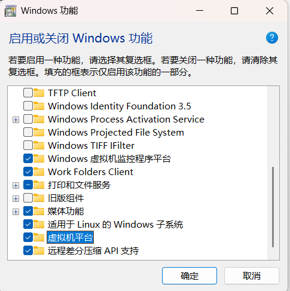
3. 点击确定，等待安装完成后重启电脑

Tips: 安装完成后，建议先检查系统版本是否达标（>=21H2）

### WSL2安装

1. 管理员身份打开windows终端
2. 命令行安装wsl2: 相关指令如下：
```
# 一键安装，自动启用功能，下载发行版，设置默认版本为2
wsl --install 

# 查看可选的wsl分发版（可选）
wsl --list --online 
# 安装指定版本
wsl --install -d Ubuntu-22.04 
```
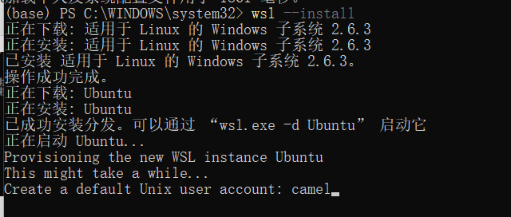
3. 安装完成后，终端提示如上，会自动打开Ubuntu终端窗口，如果没有自启动按下'win+s'，搜索Ubuntu启动
   
4. 然后按照终端提示设置用户名和密码

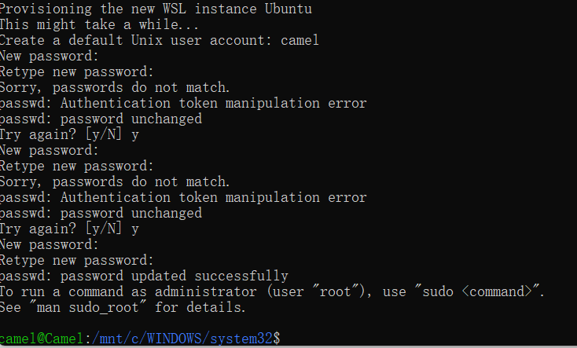
1. （可选但建议）更换国内源，我这里更换了阿里源：
  1. 先自检ubuntu版本，使用'lsb_release'命令，可以看到我的ubuntu版本是24.04：
   
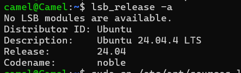
  2. 然后建议根据自己版本自行搜索换源方式，我这里直接放我的版本的操作：
```
# 备份
sudo cp /etc/apt/sources.list.d/ubuntu.sources /etc/apt/sources.list.d/ubuntu.sources.bak

# 编辑源文件
sudo nano /etc/apt/sources.list.d/ubuntu.sources

# 清空或注释所有内容替换为：
Types: deb
URIs: https://mirrors.aliyun.com/ubuntu/
Suites: noble noble-updates noble-backports noble-security
Components: main restricted universe multiverse
Signed-By: /usr/share/keyrings/ubuntu-archive-keyring.gpg

# 更新缓存
sudo apt update
sudo apt upgrade -y
```

### 常用操作命令
以下命令均在Windows终端中执行（非Ubuntu终端）可以直接复制粘贴

1. 启动与关闭
```
# 启动WSL（直接进入默认发行版Ubuntu）
wsl
# 或 启动指定发行版（替换Ubuntu-24.04为你的发行版名称）
wsl -d Ubuntu-24.04

# 关闭所有WSL实例（彻底关闭，释放内存，建议不用时执行）
wsl --shutdown

# 关闭指定发行版
wsl --terminate Ubuntu-24.04
```
2. 查看wsl状态与版本
```
# 查看已安装的所有WSL发行版，以及对应的WSL版本（1/2）
wsl -l -v
# 查看WSL版本信息
wsl --version

# 设置默认WSL版本（全局生效，后续安装的发行版默认用此版本）
wsl --set-default-version 2

# 设置默认发行版（后续输入wsl直接启动该发行版）
wsl --set-default Ubuntu-24.04
```
3. 卸载wsl发行版
```  
# 查看发行版名称（确认要卸载的发行版）
wsl -l -v
# 卸载指定发行版（替换Ubuntu-24.04为要卸载的名称，卸载后数据丢失）
wsl --unregister Ubuntu-24.04
```
### Windows与WSL文件互访

1. wsl访问Windows文件方式：
   1. Windows的C盘：在Ubuntu终端输入'cd /mnt/c'，即可进入C盘根目录
   2. windows的所有磁盘都挂在在/mnt目录下面
   3. 示例：访问C盘用户目录：'cd /mnt/c/Users/你的Windows'用户名

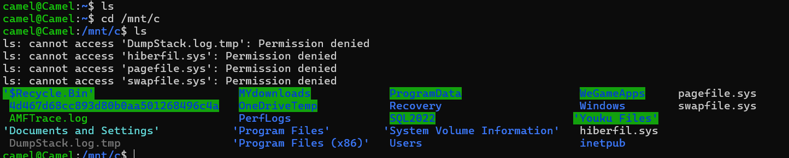

1. Windows访问WSL文件：
   1. 方法一（推荐）：Ubuntu终端输入'explorer.exe . '（注意末尾空格和点），会自动打开Windows文件管理器
   2. 方法二（有些电脑可能不行）：手动打开文件管理器，在地址栏输入'\\wsl$'回车，即可看到所有已安装的WSL发行版，双击进入即可访问文件。
VScode连接WSL

### VScode连接WSL
如果用vscode开发linux项目，直接连接wsl，可以实现在Windows中编辑，在WSL中运行，无需切换环境，比较方便
1. 安装VScode
2. 在VScode中搜索安装安装wsl插件
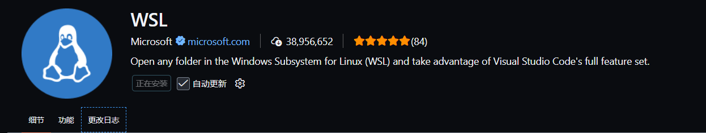
3. 点击VScode左下角><符号，然后选择连接到wsl即可
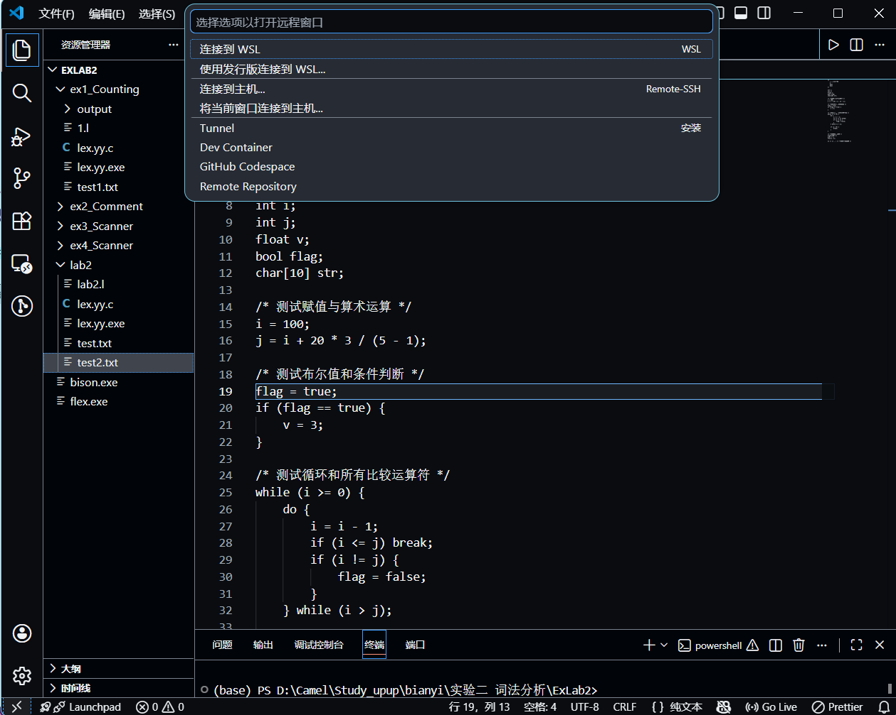
4. 成功连接后：
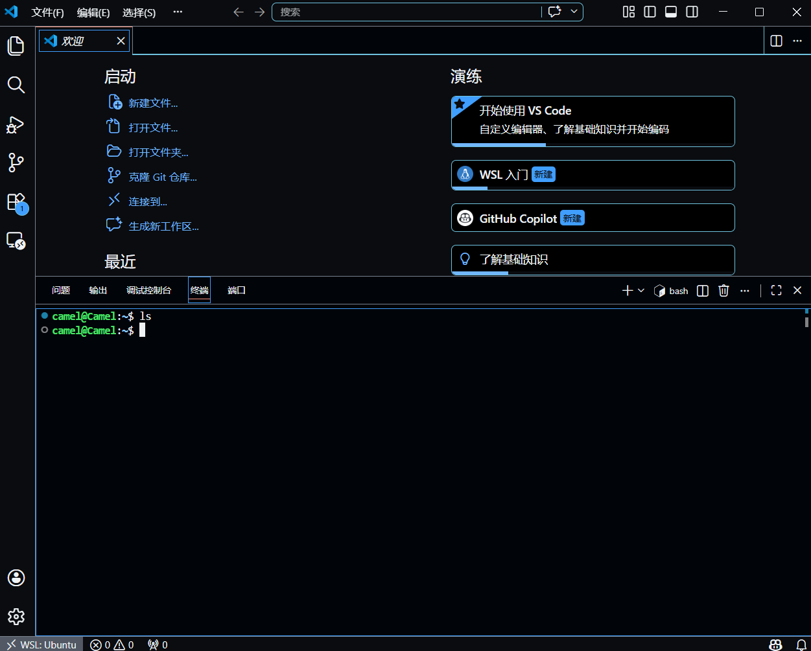
接下来就可以畅通使用wsl了！

参考文章：https://blog.csdn.net/weixin_44818765/article/details/157736533

# OpenClaw基础安装

### 写在前面

Windows安装前置要求（请安装前自行检查）：
1. Nodejs >= 22
2. WSL2
3. Git
4. 科学上网
5. pnpm（从源码构建需要，可选）

OpenClaw中文官网：https://docs.openclaw.ai/zh-CN

### 开始安装

直接选择官方推荐的一键安装方式（安装过程建议保持科学上网）：
1. 打开进入wsl
2. 运行安装命令：curl -fsSL https://openclaw.ai/install.sh | bash
   
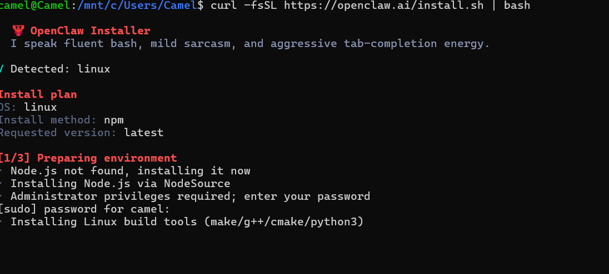

3. 需要输入一次密码，然后等待安装步骤（会先检查你的环境，是否满足之前提到的系统要求）
4. 出现以下提示，说明开始安装（一些电脑安装过程是非可视化的就和下图一样，此时只需要保证网络通畅即可）

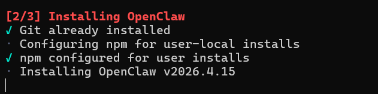

5. 出现一下界面说明安装成功：
   
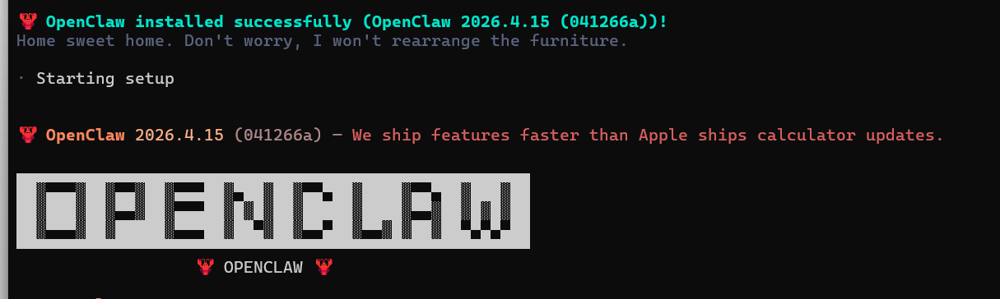

6. 这里提示我找不到环境变量：
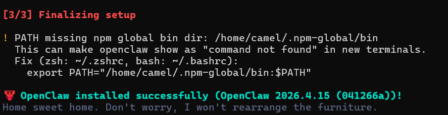

可以直接忽略，因为他已经自动把环境变量添加好了，重新打开ubuntu终端即可生效。

### 配置选择过程
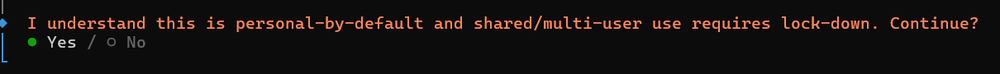

是否个人使用，选择yes

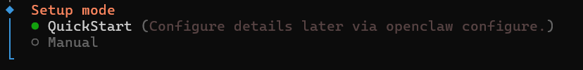

建议选择QuickStart，会自动使用合理的默认值

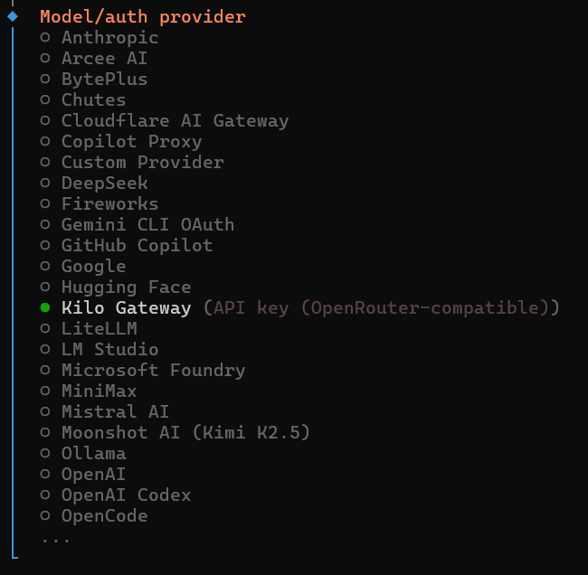

模型选择，这个可以根据各自情况自行选择（注意之前可以使用的免费千问已经不支持了，现在是需要付费的Qwen Cloud，具体可见官方文档：https://docs.openclaw.ai/zh-CN/providers/qwen）

我这里选择deepseek，然后填写apikey：

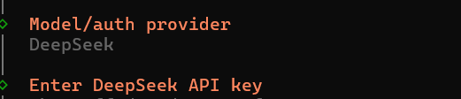
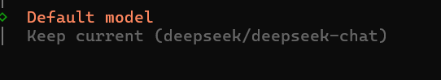

默认模型我直接选择了当前模型deepseek

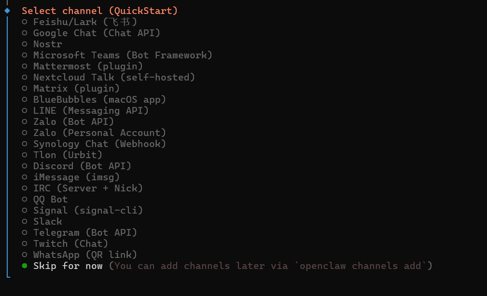

选择聊天渠道，我这里暂时先跳过

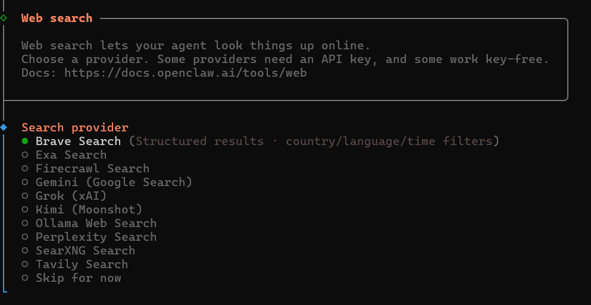

联网搜索配置，我这里也先跳过，如果后续有需要可以使用openclaw tools setup web命令配置


配置skills，我这里暂时跳过

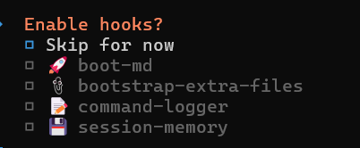

钩子我也暂时跳过

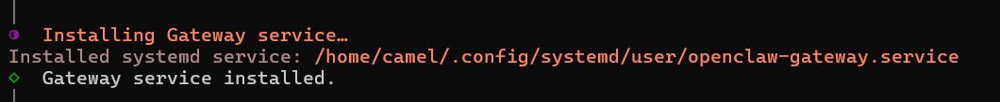

然后他会安装gateway

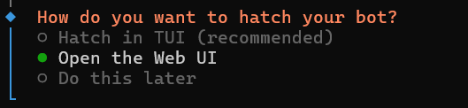

ui我选web ui，比较方便用

到这里基本配置就结束了。

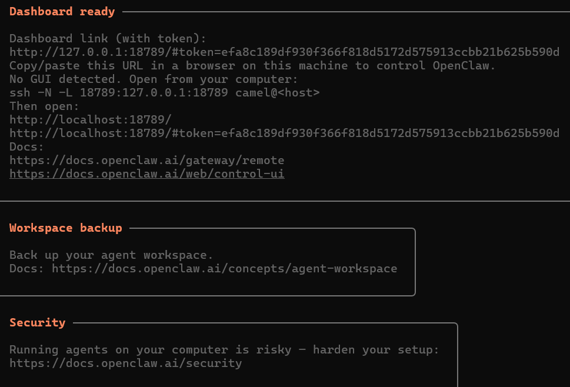

这里给了直接访问的链接（http://127.0.0.1:18789/#token=efa8c189df930f366f818d5172d575913ccbb21b625b590d）

还有工作区备份、安全警告等说明文档。

直接复制访问链接到浏览器打开即可：

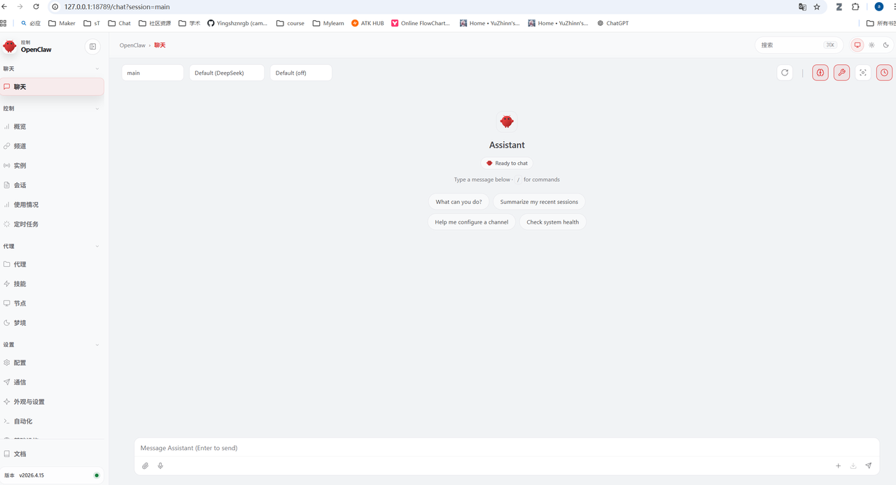
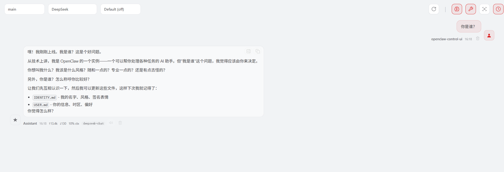

可以看到已经可以进行对话了，到这里OpenClaw的基本安装就已经结束，恭喜！！！

### 常用命令
```
# 查看配置
openclaw config list

# 修改配置
openclaw configure

# 打开web控制台
openclaw dashboard
```
更多命令可查官方速查表：[OpenClaw 超级速查表](https://openclawgithub.cc/guide/cheatsheet/#%25E6%2597%25A5%25E5%25BF%2597%25E5%2591%25BD%25E4%25BB%25A4)

参考文章：zhuanlan.zhihu.com
参考视频：https://www.bilibili.com/video/BV1WLQwBrEL8?p=6&vd_source=dc2cc07eaa930a2e35f5320de46b2f52

# OpenClaw应用实例

### OpenClaw接入微信

首先打开OpenClaw，确保启动openclaw网关：
```
openclaw gateway start
```
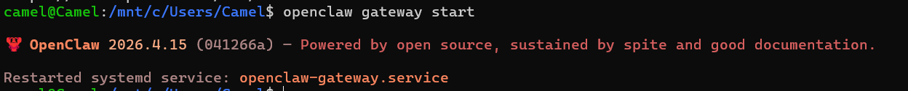

执行腾讯官方的微信对接插件安装命令：
```
npx -y @tencent-weixin/openclaw-weixin-cli@latest install
```
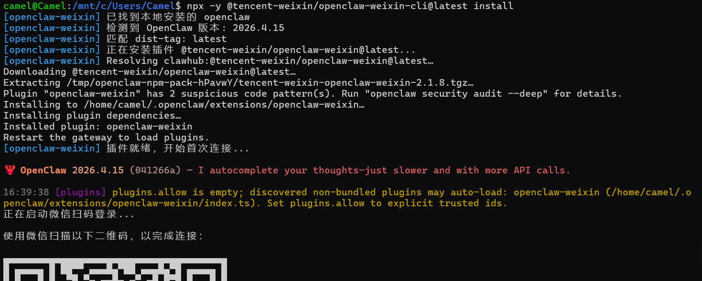

然后打开手机微信，我的，设置，插件，可以看到clawbot插件，然后扫描二维码即可连接成功：

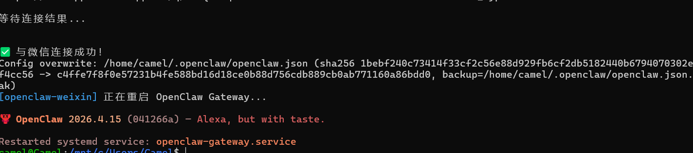
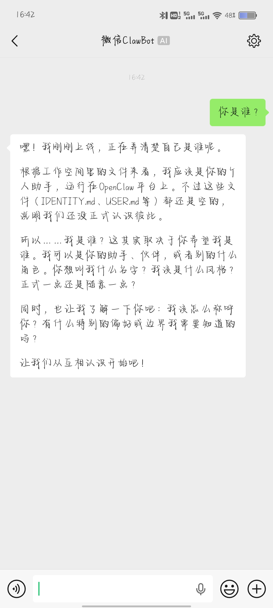

可以输入'openclaw status'查看Channels状态：


### 创建数据库

打开SQL server，并通过下列代码创建数据库：
```
-- 创建数据库
CREATE DATABASE StudentDB;

USE StudentDB;

-- 创建 Student 表
CREATE TABLE Student (
    Sno CHAR(8) PRIMARY KEY,
    Sname VARCHAR(20),
    Ssex CHAR(2),
    Sage INT,
    Sdept CHAR(4)
);

-- 创建 Course 表
CREATE TABLE Course (
    Cno INT PRIMARY KEY,
    Cname VARCHAR(20),
    Cpno INT NULL,
    Ccredit INT
);

-- 创建 SC 表
CREATE TABLE SC (
    Sno CHAR(8),
    Cno INT,
    Grade INT,
    PRIMARY KEY (Sno, Cno),
    FOREIGN KEY (Sno) REFERENCES Student(Sno),
    FOREIGN KEY (Cno) REFERENCES Course(Cno)
);

-- 插入 Student 数据
INSERT INTO Student (Sno, Sname, Ssex, Sage, Sdept) VALUES
('2024001', '林书凡', '男', 18, 'MA'),
('2024002', '李欣然', '女', 19, 'IS'),
('2024003', '王武义', '男', 20, 'CS'),
('2024004', '苏文甜', '女', 19, 'CS');

-- 插入 Course 数据
INSERT INTO Course (Cno, Cname, Cpno, Ccredit) VALUES
(1, '大数据', 3, 2),
(2, '操作系统', 5, 4),
(3, '数据库', 5, 4),
(4, '编译原理', NULL, 4),
(5, '编程语言', NULL, 2),
(6, '数据挖掘', 3, 2);

-- 插入 SC 数据
INSERT INTO SC (Sno, Cno, Grade) VALUES
('2024001', 1, 97),
('2024001', 2, 78),
('2024001', 3, 86),
('2024002', 2, 85),
('2024002', 3, 77);
```
可以看到创建成功：
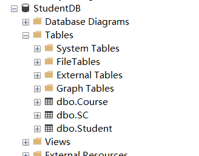
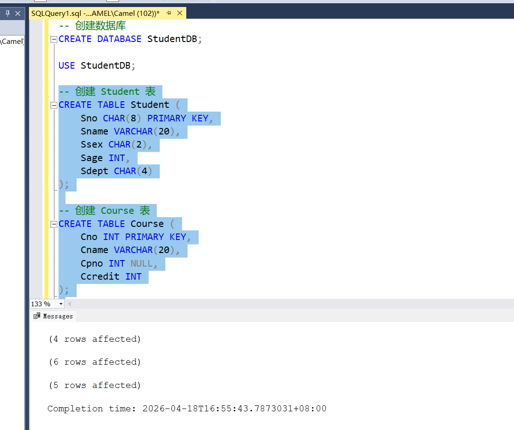

### 配置SQL server

启用TCP/IP协议：

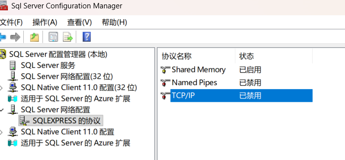

先右键启用，再右键配置属性IP地址，IPALL中TCP端口填写1433：

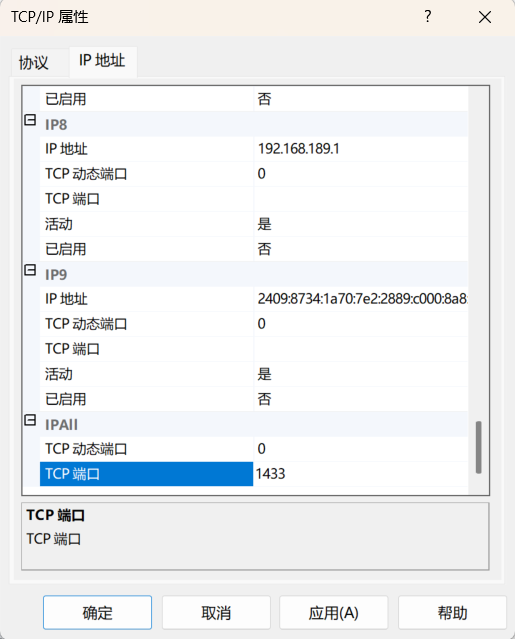

点击应用、确定，并重启SQL server服务

在安全性一栏添加登录账户，配置密码：

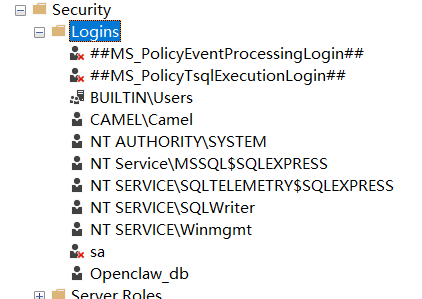
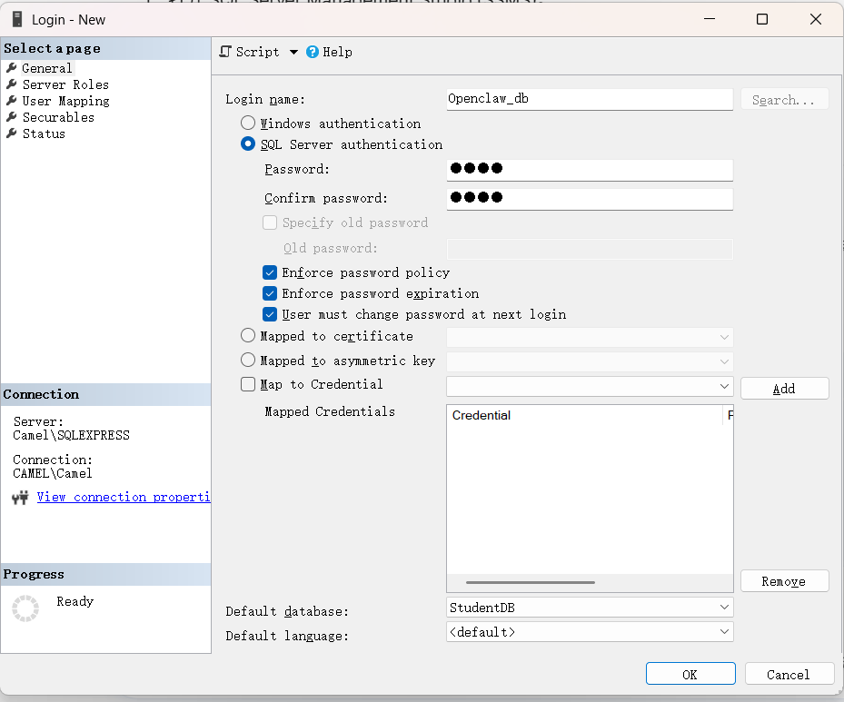

配置只读权限（图片中的是错误示例，开成了黑名单只读也就是不可读，正确的是db_datereader）：

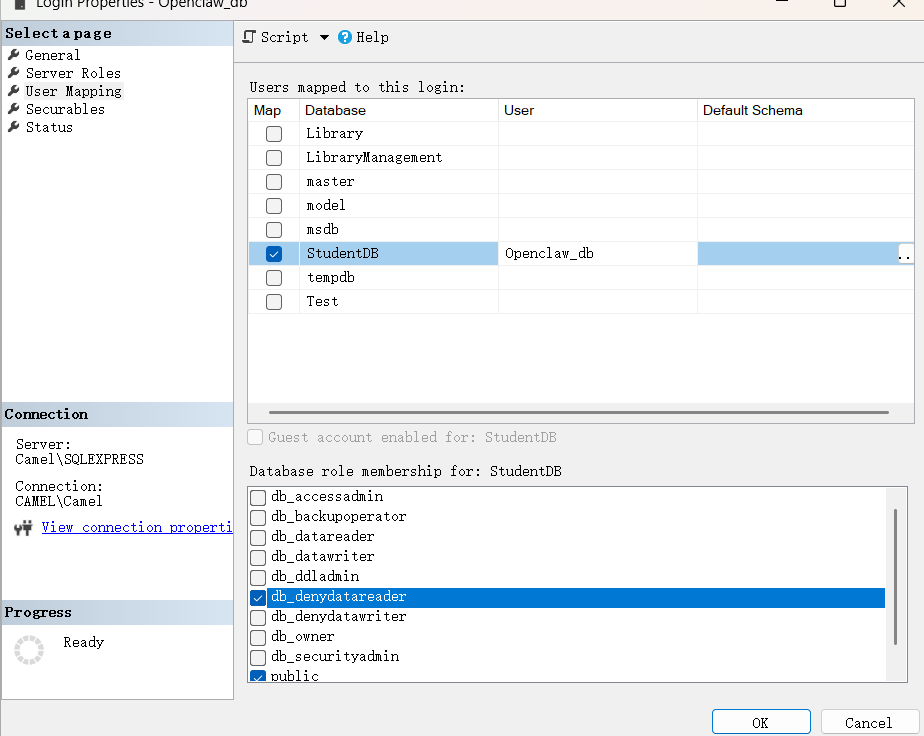

### 配置skills

搜索到两个skills比较契合该任务：

https://clawhub.ai/gitgoodordietrying/sql-toolkit

https://clawhub.ai/vince-winkintel/sql-server-skills

先安装ClawHub（skill市场）

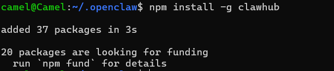

安装skills：

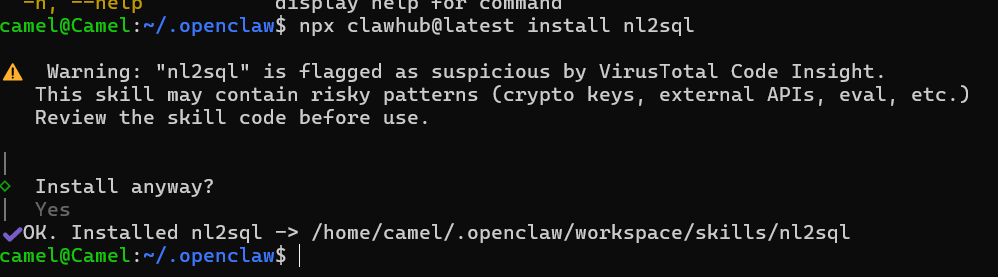
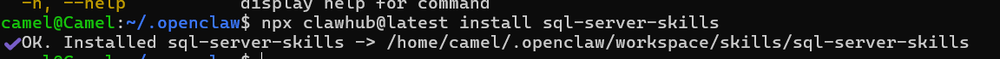

重启 OpenClaw 守护程序

### 配置openclaw

新建配置文件：

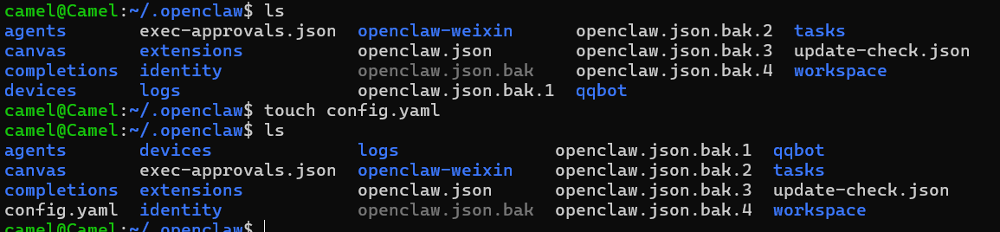

并编写配置文件内容如下：
```
# ~/.openclaw/config.yaml

skills:
  - id: "query-my-sqlserver"
    uses: "nl2sql"
    with:
      llm:
        provider: "deepseek"
        model: "deepseek-chat"

      db:
        driver: "mssql" 
        host: "10.27.194.109" # Windows IP
        port: 1433
        database: "StudentDB" # 数据库名
        username: "${env.DB_USER}"
        password: "${env.DB_PASS}"
        encryption: true

      schema: |
        -- 粘贴 CREATE TABLE 语句
        CREATE TABLE Student (
            Sno CHAR(8) PRIMARY KEY,
            Sname VARCHAR(20),
            Ssex CHAR(2),
            Sage INT,
            Sdept CHAR(4)
        );
        CREATE TABLE Course (
            Cno INT PRIMARY KEY,
            Cname VARCHAR(20),
            Cpno INT NULL,
            Ccredit INT
        );
        CREATE TABLE SC (
            Sno CHAR(8),
            Cno INT,
            Grade INT,
            PRIMARY KEY (Sno, Cno),
            FOREIGN KEY (Sno) REFERENCES Student(Sno),
            FOREIGN KEY (Cno) REFERENCES Course(Cno)
        );

# 环境变量
env:
  DB_USER: "xxxxxx"
  DB_PASS: "xxxxxx" 
```
然后与微信clawbot对话，尝试连接数据库：

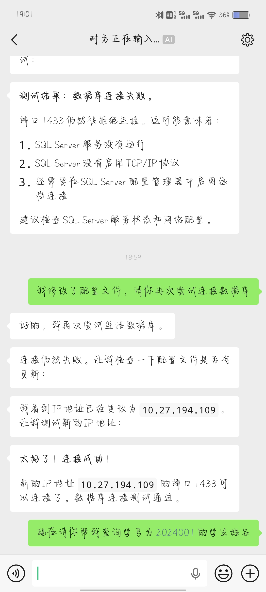

然后查询的时候遇到了问题，因为sql-server-skills需要安装sqlcmd，所以先安装sqlcmd：

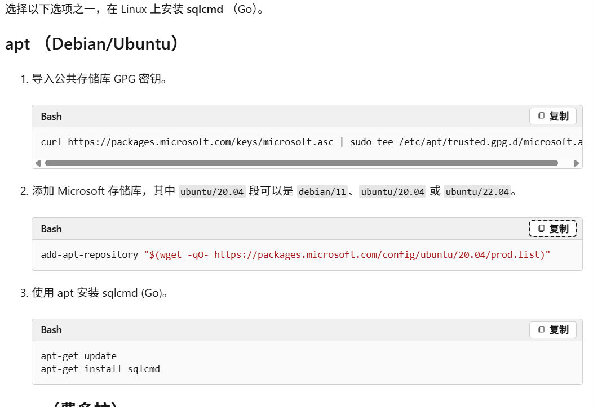
```
curl https://packages.microsoft.com/keys/microsoft.asc | sudo tee /etc/apt/trusted.gpg.d/microsoft.asc

# 由于我的ubuntu是24.04所以改成更兼容一点的22.04
add-apt-repository "$(wget -qO- https://packages.microsoft.com/config/ubuntu/22.04/prod.list)"

apt-get update
apt-get install sqlcmd
```
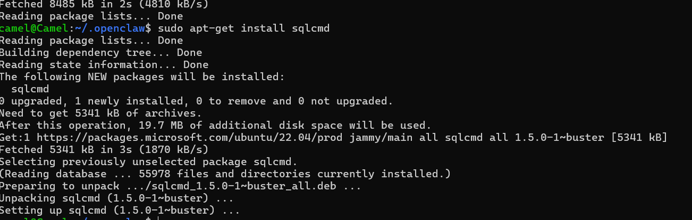

这里安装完成。

重新继续查询任务：

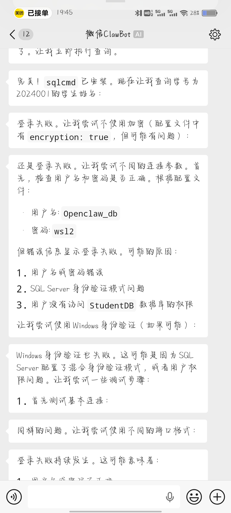

提示说登录失败，于是我修改了ssms中登录方式：

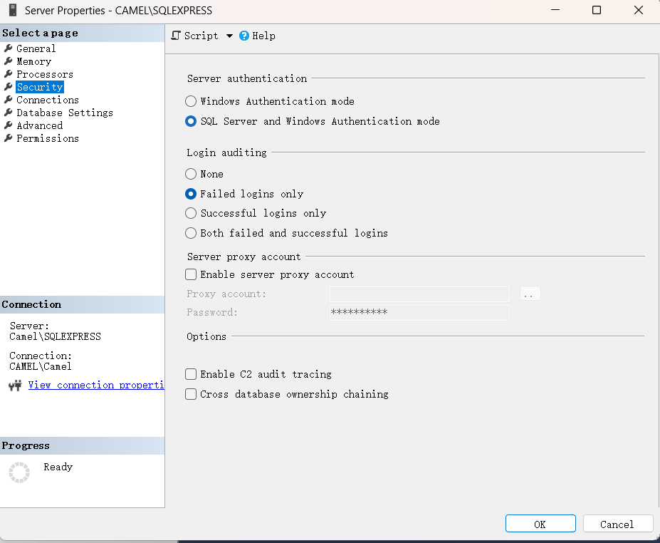

重启服务后再次尝试：

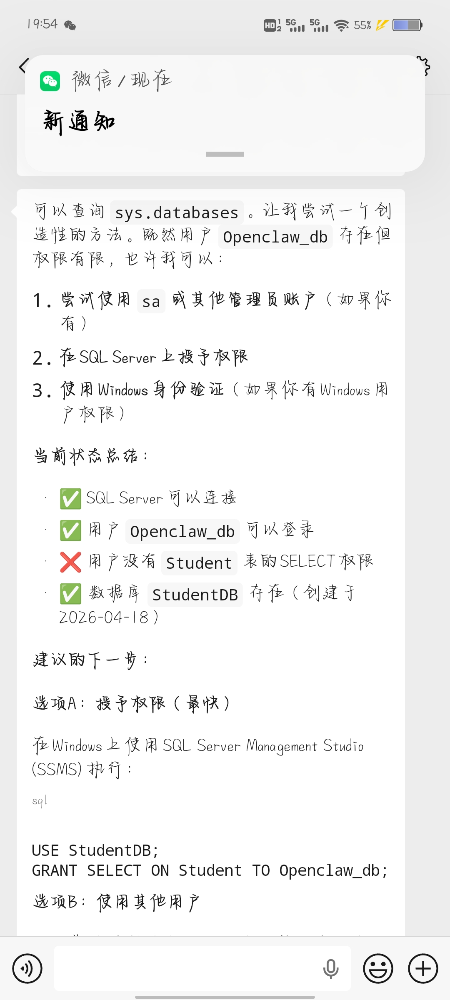

说没有select的权限，发现之前把权限设置错误了，重新配置权限：

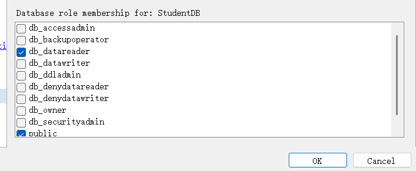

再次尝试：

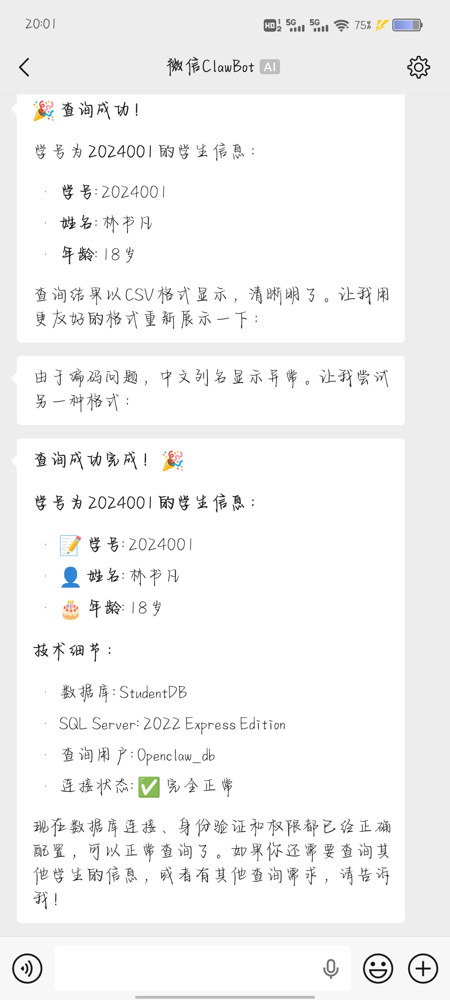

查询完成！！！

tips：

最后附一下总共token的消费：


# 小结

OpenClaw确实可以自主帮我们完成任务，但是我们的提示词一定要小心谨慎，下载skills时也要小心谨慎，因为它可能会不经过我们同意自主搞一些不太好的事情，所以大家使用的时候要小心嗷。