>这是一份专为初学者设计的建站全流程指南。你将学会如何从零开始，搭建一个高性能、可个性化、完全免费的个人博客。如果你已经是大佬，也欢迎批评指正。


### 前言：为什么你需要一个自己的博客？
我们正处在一个信息过载的数字时代。你习惯在朋友圈分享日常，在小红书标记生活，在知乎发表见解，在简历上罗列技能。但这些平台，终究是别人的“出租屋”——你遵守着它们的格式、算法和规则，内容也可能随时消失或被淹没在喧嚣的信息流中。

你有没有想过，拥有一个完全由你掌控的线上空间？一个像你的家一样，可以按照自己的审美布置、自由表达、安静沉淀的地方？

很多人可能会觉得，搭建一个看起来很酷的个人网站，是件非常复杂和昂贵的事情：需要学习 HTML/CSS/JS 全家桶，还要懂后端、数据库和服务器运维。但事实是，借助现代化的工具，这一切比你想象的要简单得多，甚至可以完全免费。

本教程将作为一个完整的指南，带你从零开始，一步步搭建并部署一个高性能、易于维护的个人博客。即使你只有基础的电脑操作能力，只要跟着步骤走，也能拥有一个属于自己的、独一无二的网络小天地。

### 什么样的人适合搭建个人博客？

在开始之前，不妨看看你是否符合下面这几类人。如果答案是肯定的，那么这个教程就是为你准备的。

- 技术萌新，充满好奇：你听说过 GitHub，知道 Git 的基本概念（比如 add、commit、push），但对前端技术栈（HTML/CSS/JS）几乎一无所知。你渴望拥有一个自己的网站，但不知道从何入手。

- 写作者，渴望沉淀：你希望在喧嚣的互联网中，找到一块属于自己的、安静的、可长期沉淀的文字自留地。你不受限于平台的格式和审查，想完全掌控自己文章的排版和呈现方式。

- 学习者，以教为学：你正在学习编程或某个领域，希望通过写博客来整理思路、记录学习过程，并分享给他人。一个好的博客本身就是最好的学习证明。

- 创作者，打造个人品牌：你是一位设计师、摄影师、开发者或自由职业者，需要一个专业的、可高度自定义的作品集或个人名片，来展示你的能力和风格，摆脱千篇一律的模板。

:::note[一句话总结：]
只要你想拥有一个免费的、美观的、完全听命于你的个人网站，无论你是否有技术背景，这个教程都适合你。
:::

### 现代前端网页搭建的基本逻辑
在动手之前，先了解一些基本的概念，有利于后续的实践操作。

:::tip[什么是静态网站？]
:::
静态网站，简单来说，就是由不会变化的固定文件组成的网站。

这些文件主要是：

- HTML（网页的结构和内容，比如文字、图片）

- CSS（网页的样式，比如颜色、字体、布局）

- JavaScript（网页的交互效果，比如点击按钮、动画）

当你在浏览器里输入一个网址，服务器就直接把这些现成的文件发送给你的浏览器，浏览器再渲染成你看到的网页。

静态网页的优点：

1. 速度快：	没有后台计算和数据库查询，文件直接发送，加载极快
2. 安全性高：	没有后端程序、没有数据库，黑客无从下手（比如无法SQL注入）
3. 成本极低：	只需要一个存文件的地方，GitHub Pages、Vercel 等平台甚至提供免费托管
4. 部署简单：	把文件上传到服务器就能访问，不需要配置复杂的运行环境
5. 适合搜索引擎：	内容是固定HTML，搜索引擎抓取非常友好（SEO天然优势）

常见的诸如 Github Pages 或者 Vercel 等平台，都是支持部署静态网页的，因此我们只需要将网页的构建产物上传到这些平台，就可以实现网页的部署。

:::tip[现代前端框架有哪些？]
:::

现代前端框架（如 **Astro**, **Vue**, **React**）允许开发者用更高效、更模块化的方式来组织代码（比如写 Markdown 文章，或者用组件拼装页面）。虽然你在开发时写的是 .vue、.jsx、.astro 等文件，但这些框架最终会通过构建工具（如 **Vite**、**Webpack**、**Rollup** 等）将你的代码转换为浏览器可以识别的 HTML、CSS 和 JavaScript 文件。这个构建过程就像“翻译”一样，把开发者写的高层代码翻译成浏览器能“听懂”的语言。

而更进一步，无数的开发者为了便利博客等网站的构建，在这些现代框架的基础上构建了模板。这意味着你无需从零开始，只需要找到一个你喜欢的模板，在作者预设好的框架里，像填写个人信息、写文章一样去填充内容即可。模板已经帮你处理了 99% 的复杂技术细节。

### 开始吧！

讲完了理论，接下来让我们开始实践吧：

下面的内容可能对于初学者朋友来说比较晦涩难懂，但是不需要懂，只要按照步骤一步一步操作，就可以收获看得见的成就，也不要因为某个步骤卡壳而灰心，当初笔者创建本网站的时候，足足用了一整个下午和晚上才搞定。

接下来我以windows操作系统以及astro框架作为例子，带大家上手。

#### 1.安装node.js
访问node官网下载node.js：[Node.js官网](https://nodejs.org/en/download)
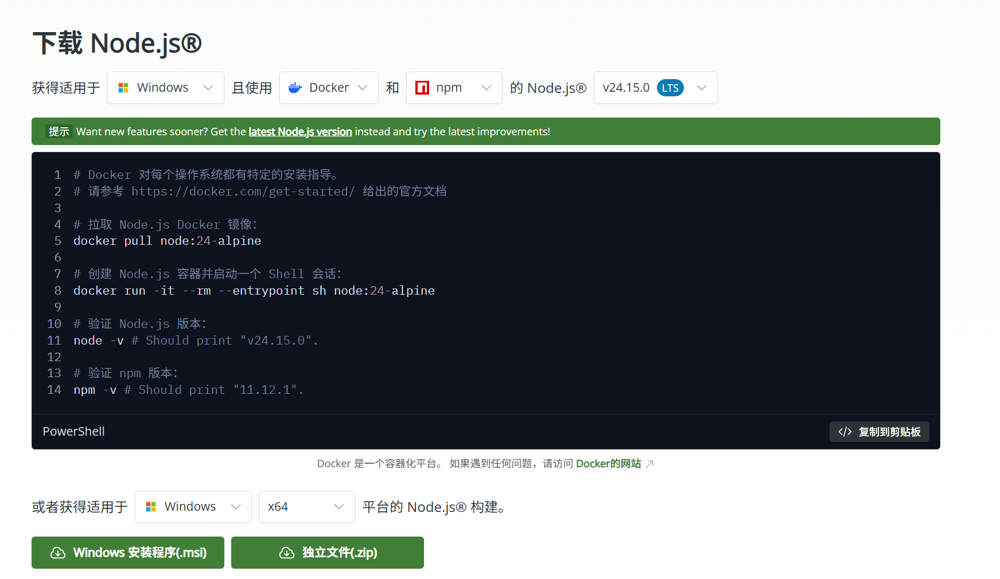

验证并安装pnpm：
打开你的终端，输入一下命令以验证安装成功：

```
node -v
npm -v
```
如果能看到版本号说明nodejs和它的包管理器'npm'已经安装成功了。
我们推荐一个更现代、更快速的包管理器'pnpm'，同时对于一些特定的框架也推荐用bun'来安装依赖：
```
npm install -g pnpm
npm install -g bun
```

:::note[NOTE]
'pnpm' 和 'bun' 都是替代 'npm' 的现代包管理工具，安装速度更快、依赖更少。大多数现代项目会推荐使用其中之一，根据项目中是否有 'pnpm-lock.yaml' 或 'bun.lockb' 来判断。
:::

### 2.选择一个框架并下载一个模板
你无需从0开始一步步搭建，网络上有非常海量的开源优秀模板。当然，在选择模板前，需要确定你要用什么框架来编写前端。

目前个人博客主流的框架有三个：Hexo、Astro、Hugo

**一句话帮你选择：纯小白用Hexo、会一些前端用Astro、~~M属性选择Hugo~~**

他们的具体区别可以借鉴这篇文章：[博客框架选择指南](https://zhuanlan.zhihu.com/p/1981456864127522296)

三个框架的官方网址：

[Hexo](https://hexo.io/zh-cn/)
[Astro](https://docs.astro.build/zh-cn/getting-started/)
[Hugo](https://gohugo.io/)

大家可以自行判断选择。

我个人偏向选择Astro，因为毕竟学过点计算机，而且Astro作为新生代框架，技术栈极其先进，可以混用React和Vue组件，开发体验非常好。

然后就可以开始搜索挑选模板了。可以直接在github中搜索，也可以在上面提到的官方网址中找。

这里我用到的一个模板是：[astro-theme-pure](https://github.com/cworld1/astro-theme-pure)

已经有了比较成熟的教程文档：[Docs of Astro Theme Pure](https://astro-pure.js.org/docs)

然后如何使用这个主题，具体教学文档见Astro官方：[Use a theme or starter template](https://docs.astro.build/en/install-and-setup/#use-a-theme-or-starter-template)

接下来我就以自己的开发过程为例子带大家过一遍操作流程：

### 3.开始本地部署
首先在vscode上下载插件Astro:
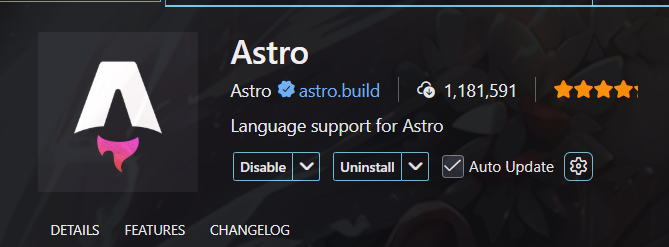

然后把模板仓库直接克隆到本地：
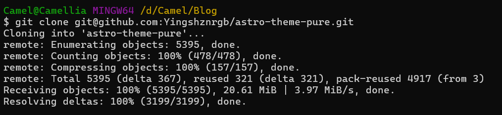

接着使用刚才下载的包管理工具安装所有依赖：
```
npm install
# 推荐使用pnpm，我当时用npm有出现一些报错
pnpm install
```
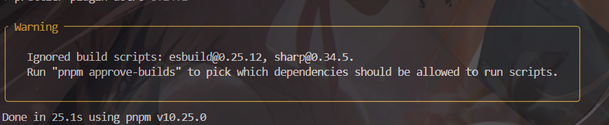

在首次安装依赖时，有一些依赖包含可能执行敏感操作的包，pnpm会拦截这些脚本的自动执行，所以会提示运行'pnpm approve-buids'来手动选择允许哪些包运行：

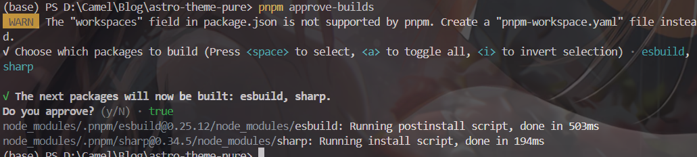

安装好所有依赖以后，就可以使用测试命令，在本地进行运行测试了：
```
pnpm run dev
```
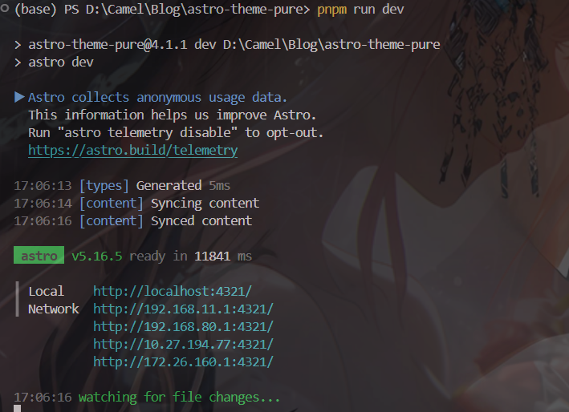

在浏览器中打开它，恭喜你，你的网站已经在本地成功运行了！

更棒的是，它支持热更新（HMR）。现在你修改任何源文件（比如一篇文章），浏览器里的页面都会自动刷新，实时展示你的改动。

### 4.个性化你的内容
本地网站跑起来了，现在是把它变成你自己的东西的时候了。作为模板使用者，你的工作非常简单，主要集中在两点：

- 修改配置文件：在项目根目录找到 astro.config.mjs, _config.yml 或类似名字的配置文件。打开它，把里面的网站标题、作者名、社交链接等改成你自己的信息。
- 管理内容文件：对于博客，通常会有一个 src/content/blog/ 或 posts/ 目录。你只需要在这个目录里添加、修改或删除 Markdown (.md 或 .mdx) 文件，网站的文章列表和页面就会自动更新。
  
:::note[NOTE]
'.md' 是 Markdown 的标准格式，用来写文章非常方便。而 '.mdx' 是带有 React JSX 成分的 Markdown 文件，支持写组件和交互元素，部分博客模板可能用它来增强功能。基本上全部的博客模板都支持 '.md' 和 '.mdx' 两种格式，同时它的基础语法非常简单，你可以在 [Markdown教程](https://markdown.com.cn/basic-syntax/) 中找到它的基本语法。
:::

### 5.将你的网站推送到GitHub

在本地修改完成后，我们通常需要把代码上传到GitHub，这不仅是备份的好习惯，更是我们实现自动化部署的关键一步

假如说你直接 'git clone' 了源码，可以直接删掉 '.git' 文件夹，然后执行 'git init' 初始化一个新的仓库。

在 [GitHub官网](https://github.com/) 官网上创建一个新的空仓库（New Repository）。

根据 GitHub 页面的提示，在你本地的项目文件夹中，通过终端执行以下命令，将代码推送到你的新仓库：
```
git init -b main
git add .
git commit -m "Initial commit: My personal website setup"
git remote add origin [你的仓库HTTPS或SSH地址]
git push -u origin main
```
假如说本来就是从自己的仓库中克隆的，则可以直接执行 'git push' 将代码推送到远程仓库。

### 6.使用Vercel/GitHub Page一键部署
最激动人的时刻到了，如何让全世界的人都能访问到你的网站，我们将使用Vercel或者GitHub Page实现这个功能

这边建议大家直接用Vercel，以为一方面我选择的这个模板本身有部署在Vercel上，如果要部署在GitHub Page上的话，需要修改许多配置，并且需要你手动配置构建流程（GitHub Actions)，我当时遇到了很多麻烦（感兴趣可以看我这篇文章：[我的个人博客搭建历程](https://yuzhinn.top/blog/build-blog/build-blog)）

1. 用GitHub登录Vercel：

前往 [Vercel](https://vercel.com/)，点击右上角的“Login”，选择使用 GitHub 账号授权登录。

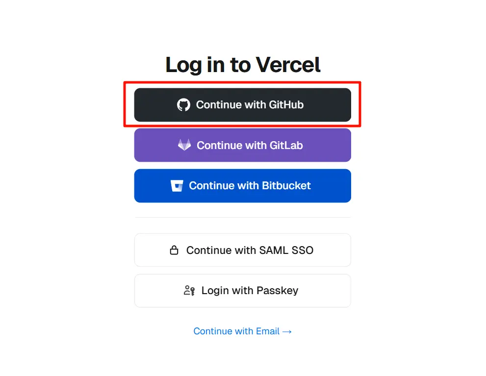

2. 导入你的项目
登录后，在主面板点击 'Add New…' → 'Project'。之后选择你自己的账号，直接 'instal vercel'。
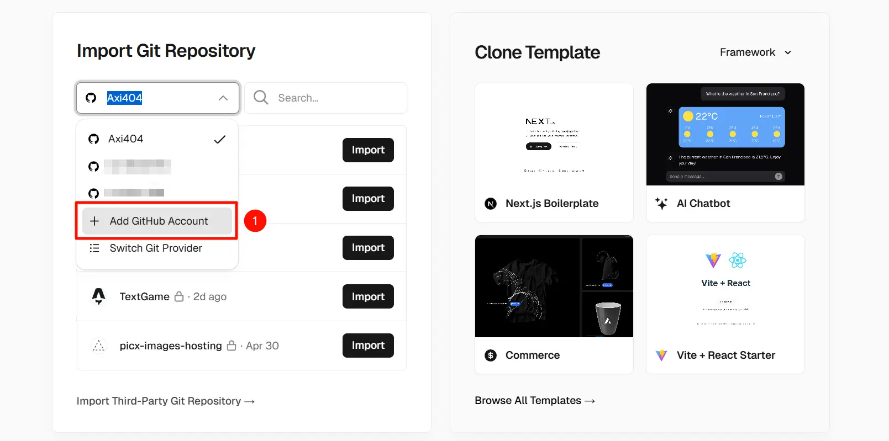
Vercel 会列出你的 GitHub 仓库，找到你刚刚创建的网站仓库，点击旁边的 Import 按钮。
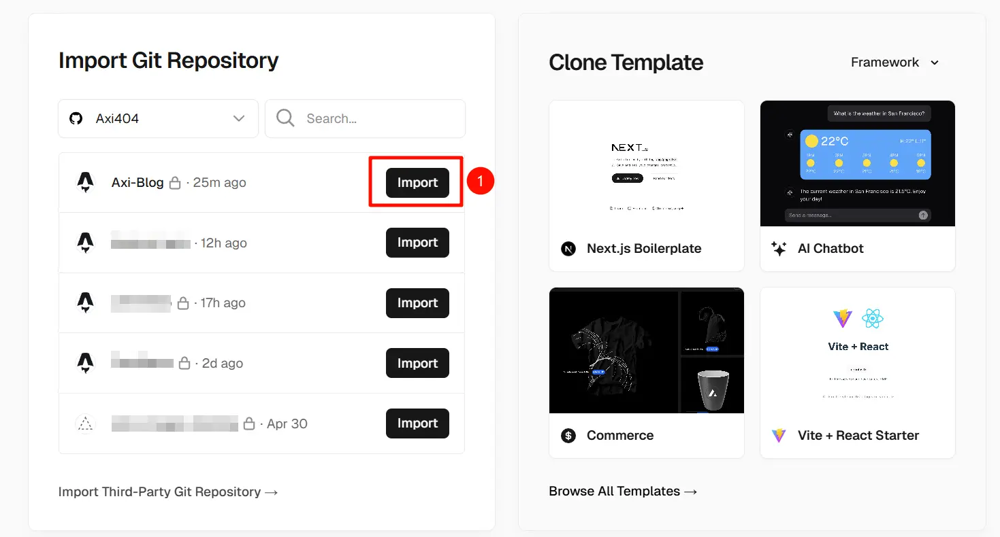

3. 部署！ Vercel 会自动识别你的项目是什么框架（Astro, Next.js, etc.），并帮你填好所有构建设置。你什么都不用改，直接点击 Deploy 按钮。
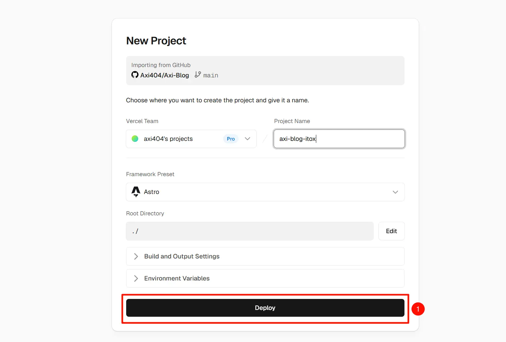

稍等片刻，Vercel 就会完成构建和部署。当看到庆祝的动画时，你的网站就已经上线了！Vercel 会提供一个 '.vercel.app' 结尾的免费域名供你访问。
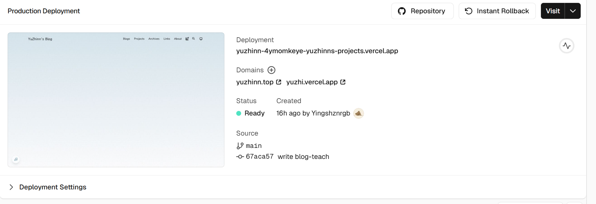

从此以后，你只需要在本地修改代码，然后 git push 到 GitHub，Vercel 就会自动拉取最新代码，重新构建和部署你的网站。完全自动化！

### 7.绑定你的专属域名（可选）
拥有一个'yourname.com'这样的域名，你的网站才算完整。
1. 购买域名
前往 [NameSilo](https://www.namesilo.com/)、[GoDaddy](https://godaddy.com/) 等域名注册商，购买一个你喜欢的域名。过程就像网购一样简单。

2. 使用Cloudflare管理DNS
虽然域名商也提供DNS解析，但是Cloudflare提供免费的全球CDN加速和更强大的安全防护。

- 注册并登录 [Cloudflare](https://dash.cloudflare.com/)。
- 点击 'Add a domain'，输入你购买的域名，选择免费（Free）套餐。
  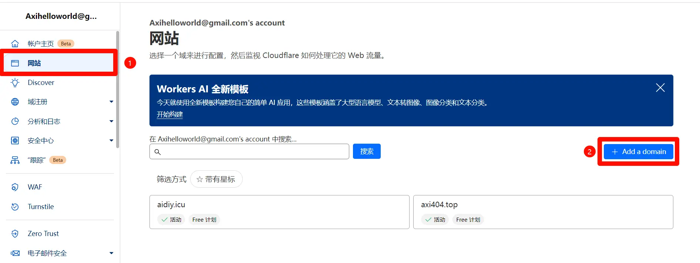

接下来输入你的域名，这里以一个不存在的域名为例：

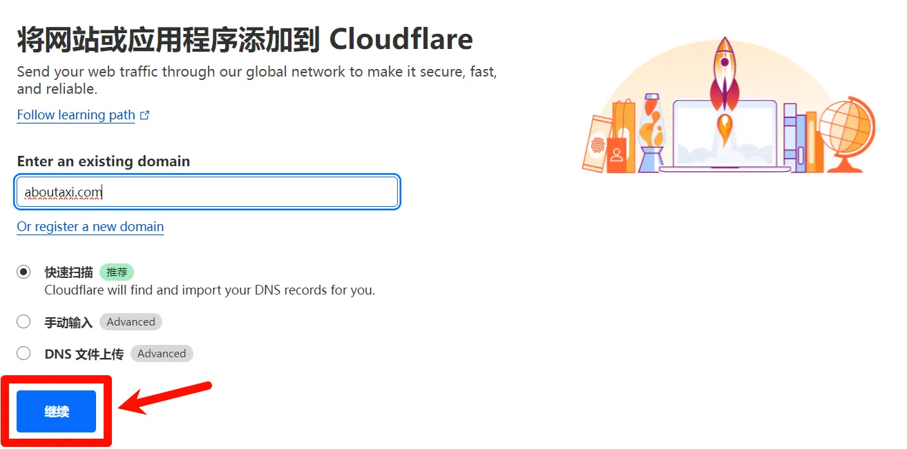

遗憾选择 Free 方案，完全已经够用：

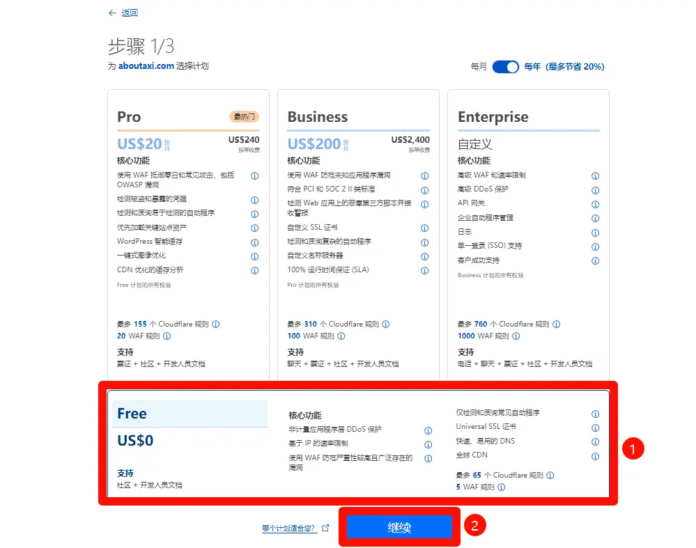

接下来 DNS 记录先跳过，之后再添加。

- Cloudflare 会扫描你现有的 DNS 记录（如果是新域名，这里是空的），然后提示你更改 NameServer。
  
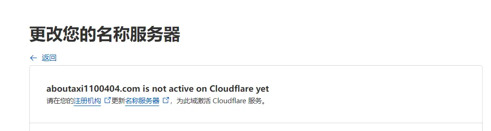

它会提供两个 NameServer 地址。

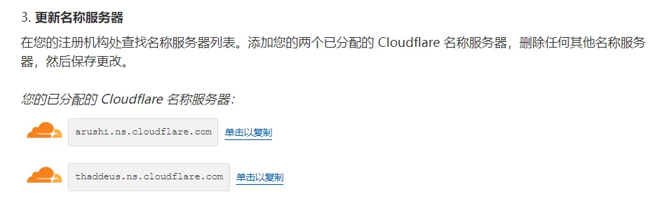

- 回到你的域名注册商（如 NameSilo）的域名管理后台，找到 NameServer/DNS服务器 设置，删除原来的，替换为 Cloudflare 提供的那两个地址。例如对于 NameSilo，在 My Account -> Domain Manager -> yuzhinn.top -> NameServers 删掉原来的东西，并且添加这些。

- 等待几分钟到几小时，时常刷新一下，让更改生效。
  
3. 在 Vercel 和 Cloudflare 中配置
  
- Vercel 端：进入 Vercel 的项目设置（Settings → Domains），输入你的域名并添加。
  
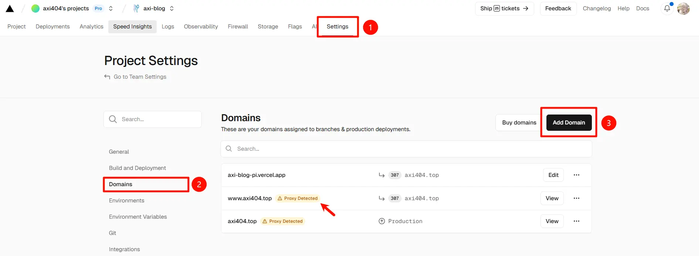

- Cloudflare 端：在你的域名管理页面，进入 DNS → Records，添加一条 CNAME 记录：
  - Type: CNAME
  - Name: @ (代表你的根域名)
  - Target: cname.vercel-dns.com
  - Proxy status: Proxied (保持橙色云朵亮起)
  
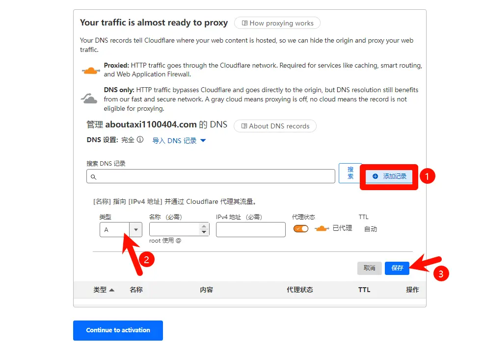

最后，在 Cloudflare 的 SSL/TLS 页面，将加密模式设置为 Full (strict)，以确保端到端的安全连接。

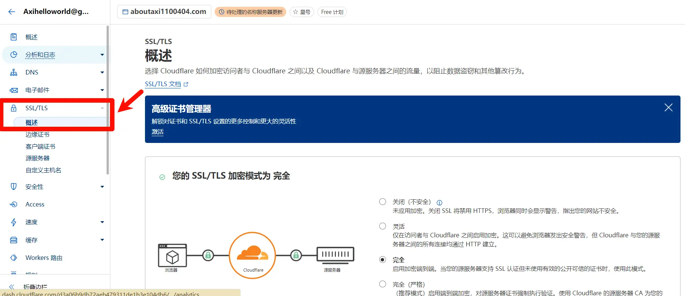

完成这些，稍等片刻，你就可以通过自己的专属域名访问你的网站了！

### 总结
通过以上步骤，你已经可以实现从零到一地搭建自己地网站了，在此基础上，你可以通过修改原有内容实现个性化，也可以混合多个不同模板的组件实现一些更有趣的需求，也可以通过强大的前端ai工具，帮你将想法落地现实。

但是现在你的网站还存在很多的问题，比如，国内访问速度有限、功能比较单一、开发效率不够，这些都需要你开动脑筋，利用云服务器、各种强大的ai工具（例如OpenClaw、Hermes）等提高你的效率，提升你的网站访问速率。

从这里开始，尽情创造吧！

最后给大家一些优秀的博客案例：

https://unmei.cn/

https://2cat.net/

https://idealclover.top/

https://axi404.top/

https://d-sketon.github.io/astro-theme-reimu/

https://liaoxuefeng.com/index.html

https://www.ruanyifeng.com/

参考文章：

https://xue6ing.cn/archives/1705394947292

https://axi404.top/blog/website-vercel#%E5%89%8D%E8%A8%80

https://astro-pure.js.org/docs
