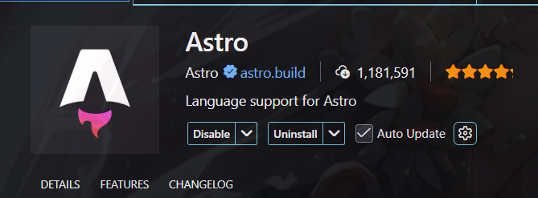
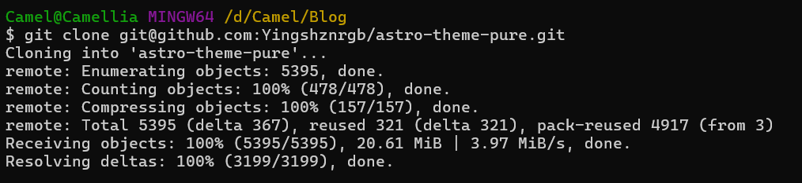
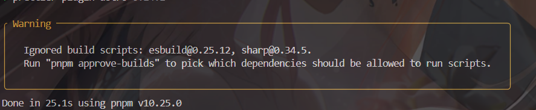
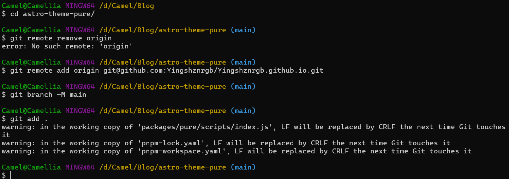
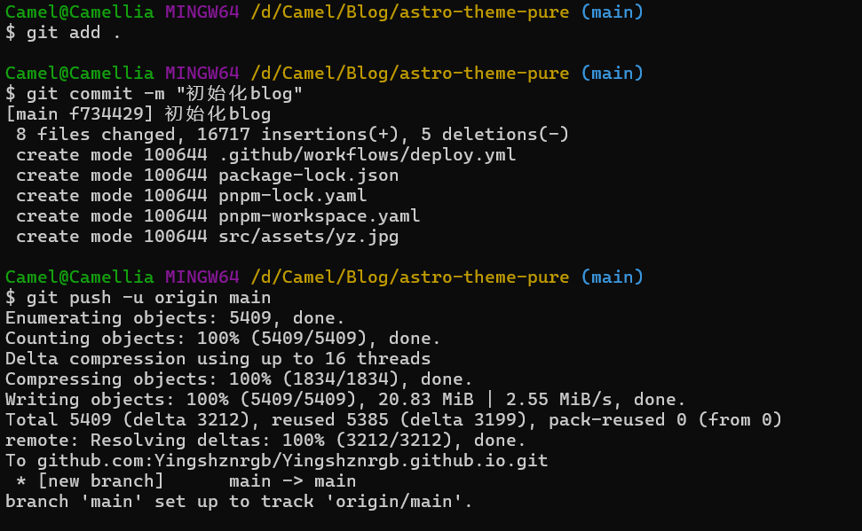
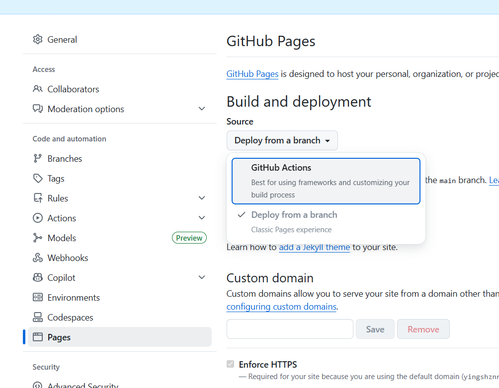
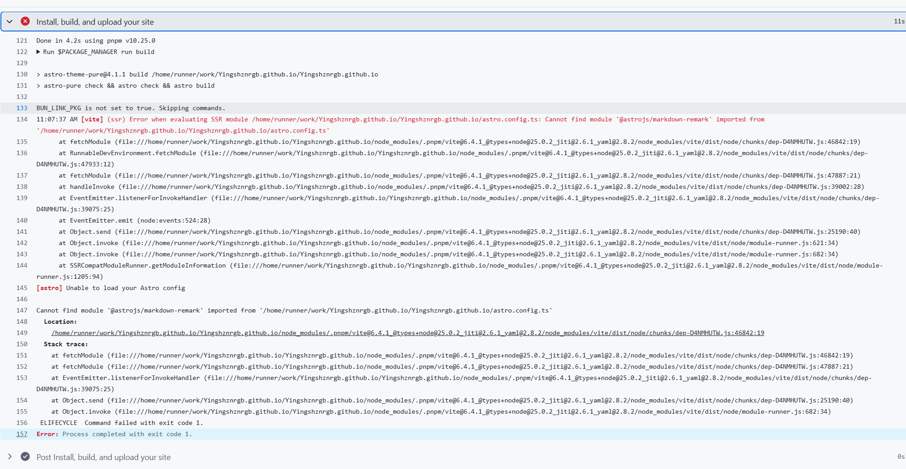
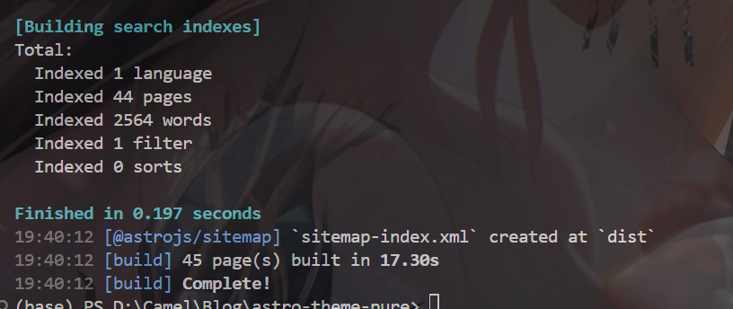

起因是笔者看到某大佬的个人博客大受震撼，想要搭一个自己的博客，将学习过程记录以方便读者（~~如果有~~）借鉴（笔者在此之前是完全没学过前端，只会写一点点html和css, js基本不会，纯小白了也算是）

## 框架选择
目前主流框架有三个：Hexo、Astro、Hugo

一句话：小白选Hexo、会前端选Astro，~~M属性选Hugo~~。

借鉴这篇文章：https://zhuanlan.zhihu.com/p/1981456864127522296

官方网址：

Hexo:https://hexo.io/zh-cn/

Astro:https://docs.astro.build/zh-cn/getting-started/

Hugo：https://gohugo.io/

我选择了Astro，然后找了一个主题感觉不错先用着：

https://github.com/cworld1/astro-theme-pure

教程：

https://astro-pure.js.org/docs

https://docs.astro.build/en/install-and-setup/#use-a-theme-or-starter-template

## 本地部署：
Node 版本：v20
```
D:\Camel\Blog>node --version
v20.15.1
```
安装vscode扩展



把代码clone一下：



然后：
```
npm install //安装所有依赖
```
因为有报错所以尝试用pnpm安装：
```
npm install -g pnpm
pnpm install
```

最后用测试命令运行：
```
pnpm run dev
```


然后就跑起来啦！

后面Blog的具体搭建就是自己慢慢学习和测试的过程喽（欢呼）。

## 挂到github pages上：
先搞一个最简单的试一下，后面再尝试vercel等等

强烈建议先在本地调试！！！调试到没有错误再挂github
```
pnpm run build
```
因为这个主题项目本身是挂在vercel上的，所以要先卸载一些相关的包和修改一些配置。

先在github上新建一个空仓库，命名必须是：用户名.github.io

在根目录新建.github文件夹（已有的话直接下一步）
在.github下面新建workflows文件夹
在workflows文件夹下面新建deploy.yml文件，放下面内容（这是适配 pnpm 的自动部署脚本）：
```
name: Deploy to GitHub Pages

on:
  push:
    branches: [ main ]
  workflow_dispatch:

permissions:
  contents: read
  pages: write
  id-token: write

jobs:
  build:
    runs-on: ubuntu-latest
    steps:
      - name: Checkout your repository using git
        uses: actions/checkout@v4
      
      - name: Install, build, and upload your site
        uses: withastro/action@v2
        with:
            package-manager: pnpm

  deploy:
    needs: build
    runs-on: ubuntu-latest
    environment:
      name: github-pages
      url: ${{ steps.deployment.outputs.page_url }}
    steps:
      - name: Deploy to GitHub Pages
        id: deployment
        uses: actions/deploy-pages@v4
```
然后


回到github，setting，Pages，选择Github Actions（因为刚才配置了deloy.yml文件）


然后点击前往Action界面：
报错：

说是GitHub 正在尝试用 Jekyll（一种老旧的博客生成器）来构建你的网站，而不是用 Astro

在public文件夹下新建文件.nojeky11

然后重新git add - push

报错：

原因：我的 astro.config.ts 配置文件里写了一句代码引用了 @astrojs/markdown-remark 这个工具，但是你的 package.json（依赖列表）里并没有安装它。

于是：pnpm add -D @astrojs/markdown-remark

然后重新git add - push

然后又报错...

一系列调试之后，终于本地调通了😭😭：


但是github依旧报错...

长达一个小时的调试，终于调通了（释然）。


## 其他平台选择
Github pages:https://docs.github.com/en/pages/quickstart

vercel:https://zhuanlan.zhihu.com/p/641263373   

cloudflare pages:https://dash.cloudflare.com/487b19a8595082c8ae72aa2d1a2706a1/home/domains


绑定域名：https://xue6ing.cn/archives/1705394947292

eu.org免费域名：https://xue6ing.cn/archives/free-yu-ming-yao-bu-yao 


[图片]
## ps
astro一些主题：
https://astro-pure.js.org/docs

https://d-sketon.github.io/astro-theme-reimu/
